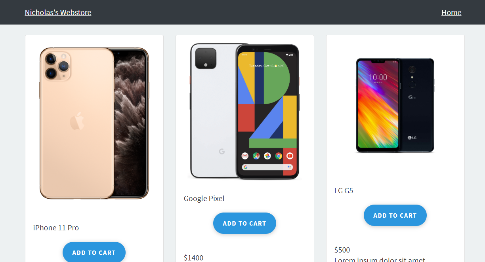

# Nicholas's Webstore for Adyen Application




### Running the Node.js Server

This project was build on Node JS, based on the sample provided by Adyen

If preferred, you can run a Node.js server instead.
To do this, navigate to the root of the project, install the dependencies (only the first time) and run the start script:

```
$ cd adyen-components-js-sample-code
$ npm i
$ npm start
```

A Node.js server will start on `http://localhost:3000`.

## License

This repository is open source and available under the MIT license. For more information, see the LICENSE file.
